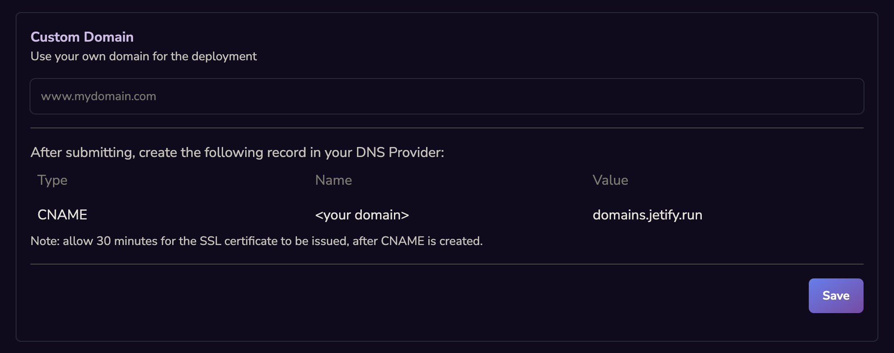
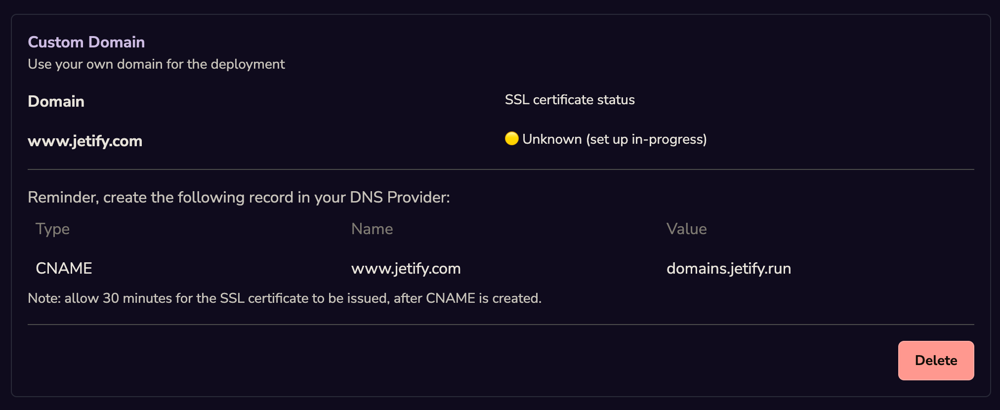
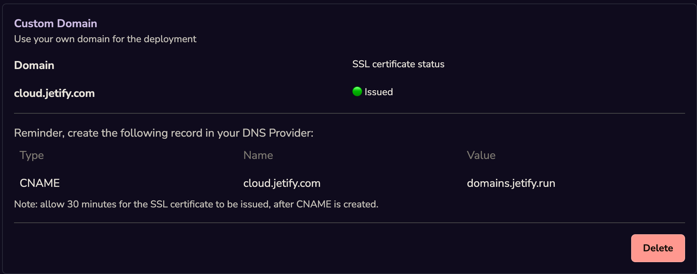

<Info>
  You will need access to the DNS records for your Domain in order to configure it for Jetify Cloud.
</Info>

## Adding a Custom Domain[​](#adding-a-custom-domain "Direct link to Adding a Custom Domain")

1. In your project on the Jetify Cloud Dashboard, select **Settings**
2. Scroll down to the **Custom Domain** section on the settings page
   
3. Enter the custom domain name that you would like to use for your project
4. After you click confirm, your custom domain will be set in a pending state. To validate the
   domain, you will need to add a record to your DNS provider:
   
5. Once the correct records have been added to your DNS provider, your Custom Domain will display an
   **Issued** status:
   

## Removing a Custom Domain[​](#removing-a-custom-domain "Direct link to Removing a Custom Domain")

You can remove a custom domain by clicking the Delete button. This will remove the domain from your
project. Note that after removing the domain, you may want to also clean up your DNS records.
